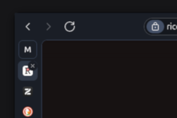

# Collapesed Tab Close Button

This extension adds a close button to the collapsed tabs in Zen Browser.

## What the extension does

This theme does:

- Display a close button on the collapsed tabs
- On hover, the close button will be shown

Have any suggestions or feedback? Feel free to open an issue in the [GitHub repository]().

## Stroll through ricefield

If you like this project, you can explore more of my projects on my [GitHub profile](https://github.com/burnt0rice) or on my [website](https://ricefield.ch).
