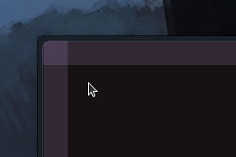

# Increase Compact Hover

This theme increases the hover area in compact mode of the sidebar and toolbar in the Zen Browser.

## What the theme does

This theme does:

- Increases (``+30px``) the hover area of the sidebar and toolbar in compact mode
- Makes the sidebar and toolbar more accessible in compact mode

Have any suggestions or feedback? Feel free to open an issue in the [GitHub repository](https://github.com/burnt0rice/zen-themes/issues).

## How to install

> Note: The theme is not yet available in the Zen Browser Theme Store.

1. Go to the [Zen Browser Theme Store](https://zen-browser.app/themes/)
2. Click on the "Install Theme" button
3. Enjoy

## Stroll through ricefield

If you like this project, you can explore more of my projects on my [GitHub profile](https://github.com/burnt0rice) or on my [website](https://ricefield.ch).
